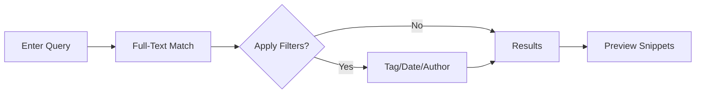

## Overview

Artist Game provides powerful tools to structure, collaborate on, version, and search your documentation. You create hierarchical documents, invite team members, track changes, and find content quickly.

<Columns cols={2}>
  <Card title="Structuring & Editing" icon="edit-3" href="#document-structuring">
    Build nested pages with rich text, embeds, and custom components.
  </Card>
  <Card title="Collaboration" icon="users" href="#collaboration">
    Invite collaborators, set permissions, and share securely.
  </Card>
  <Card title="Version History" icon="git-branch" href="#version-history">
    Track every change with full revert capabilities.
  </Card>
  <Card title="Search & Filtering" icon="search" href="#search-filtering">
    Find documents instantly with advanced filters.
  </Card>
</Columns>

## Document Structuring and Editing

You organize documentation into nested pages using a tree-like structure. Create pages, subpages, and blocks for text, code, images, and embeds.

<Steps>
  <Step title="Create a New Document" icon="plus">
    Navigate to your workspace and click `New Page`. Add a title like "Artist Game API Guide".
  </Step>
  <Step title="Add Nested Content" icon="folder">
    Drag blocks to nest them. Use slash commands like `/heading` or `/code` for quick inserts.
  </Step>
  <Step title="Embed Rich Media" icon="image">
    Type `/image` or `/video` to embed assets. Supports Markdown for custom formatting.
  </Step>
</Steps>

Here is a sample Markdown structure you embed:

<CodeGroup tabs="Markdown,HTML">
  ```markdown
  # Artist Game API

  ## Authentication

  Use `{API_KEY}` for requests.

  ```javascript
  fetch('https://api.example.com/artist-game/v1/auth', {
    headers: { Authorization: `Bearer ${YOUR_API_KEY}` }
  });
  ```
  ```
  ```html
  <h1>Artist Game API</h1>
  <h2>Authentication</h2>
  <p>Use <code>API_KEY</code> for requests.</p>
  <pre><code>fetch('https://api.example.com/artist-game/v1/auth', {
  headers: { Authorization: `Bearer ${YOUR_API_KEY}` }
});</code></pre>
  ```
</CodeGroup>

<Callout kind="tip">
  Use keyboard shortcuts like <kbd>Cmd</kbd>+<kbd>K</kbd> to jump to blocks and speed up editing.
</Callout>

## Collaboration and Sharing Options

Invite teammates and control access levels. You share documents publicly or privately.

<Tabs>
  <Tab title="Invite Collaborators" icon="user-plus">
    Go to `Share` > `Invite`. Enter emails and select roles: Editor, Viewer, or Admin.
  </Tab>
  <Tab title="Generate Share Links" icon="link">
    Click `Share` > `Public Link`. Set expiration or password protection.
  </Tab>
  <Tab title="Permission Management" icon="shield">
    In settings, assign granular permissions like "Edit Content" or "Manage Versions".
  </Tab>
</Tabs>

## Version History Management

Artist Game automatically saves every change. You view diffs, restore versions, and branch documents.

<Steps>
  <Step title="View History" icon="clock">
    Click the `History` icon on any page. See a timeline of edits.
  </Step>
  <Step title="Compare Changes" icon="git-compare">
    Select two versions to see side-by-side diffs.
  </Step>
  <Step title="Restore Version" icon="refresh-cw">
    Click `Restore` on any version to revert instantly.
  </Step>
</Steps>

Retrieve history via API:

<CodeGroup tabs="cURL,JavaScript">
  ```bash
  curl "https://api.example.com/artist-game/v1/documents/{docId}/history" \
    -H "Authorization: Bearer YOUR_API_KEY"
  ```
  ```javascript
  const history = await fetch('https://api.example.com/artist-game/v1/documents/{docId}/history', {
    headers: { Authorization: `Bearer ${YOUR_API_KEY}` }
  }).then(r => r.json());
  ```
</CodeGroup>

## Search and Filtering Tools

Search across all documents with full-text capabilities. Filter by tags, authors, or dates.

| Filter Type | Description | Example |
|-------------|-------------|---------|
| Full-Text | Matches keywords in content | `Artist Game API` |
| Tags | Filters by custom labels | `tag:api` |
| Date Range | Recent changes | `created:>2024-01-01` |
| Author | By contributor | `author:john@example.com` |

<Expandable title="Advanced Search Syntax" default-open="false">

Combine filters: `api tag:docs created:>2024-01-01 author:team@artistgame.com`.


</Expandable>

<Callout kind="info">
  Pro tip: Pin frequent searches to your dashboard for one-click access.
</Callout>

These features make Artist Game your go-to for scalable documentation. Explore [quickstart](/quickstart) next to get hands-on.