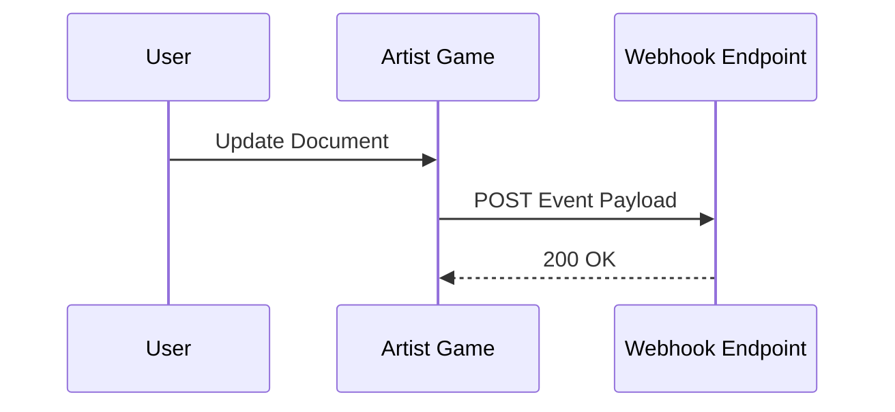

## Overview

Artist Game supports seamless integrations with popular third-party services, webhooks for real-time notifications, a robust API for custom workflows, and flexible export/import options. You configure these integrations from your dashboard at `https://dashboard.example.com/integrations`.

Use third-party apps to sync content automatically. Set up webhooks to trigger actions on document updates. Leverage the API for programmatic access. Export data in multiple formats for backups or migrations.

<Callout kind="tip">
  Review your integration permissions before enabling new connections to avoid unintended data sharing.
</Callout>

## Third-Party Integrations

Connect Artist Game to tools like Slack, GitHub, and Zapier to automate workflows.

<Columns cols={3}>
  <Card title="Slack" icon="message-circle" href="https://slack.com/apps" target="_blank">
    Receive notifications for document changes and approvals.
  </Card>
  <Card title="GitHub" icon="github" href="https://github.com" target="_blank">
    Sync documentation repos with automatic pulls and pushes.
  </Card>
  <Card title="Zapier" icon="zap" href="https://zapier.com" target="_blank">
    Build no-code automations with 5000+ apps.
  </Card>
</Columns>

To connect:

<Steps>
  <Step title="Navigate to Integrations" icon="settings">
    Go to `https://dashboard.example.com/integrations`.
  </Step>
  <Step title="Select Provider" icon="plus">
    Choose your app and authorize access.
  </Step>
  <Step title="Configure Events" icon="sliders">
    Select triggers like document updates or publishes.
  </Step>
</Steps>

## Webhook Configuration

Webhooks let external services receive real-time events from Artist Game, such as new document versions.



<Steps>
  <Step title="Create Webhook" icon="link">
    In the dashboard, go to Integrations > Webhooks > New Webhook.
  </Step>
  <Step title="Set Endpoint" icon="globe">
    Enter your URL, e.g., `https://your-webhook-url.com/artistgame`.
  </Step>
  <Step title="Choose Events" icon="bell">
    Select events like `document.updated` or `document.published`.
  </Step>
  <Step title="Verify" icon="check-circle">
    Test with sample payload and save.
  </Step>
</Steps>

Example payload:

<CodeGroup tabs="JSON">
  ```json
  {
    "event": "document.updated",
    "document_id": "doc_123abc",
    "timestamp": "2024-01-15T10:30:00Z",
    "user_id": "user_456def"
  }
  ```
</CodeGroup>

<Callout kind="alert">
  Secure your webhook endpoint with HMAC signatures. Artist Game includes a `signature` header for verification.
</Callout>

## API Integration Basics

Artist Game's REST API at `https://api.example.com/v1` handles all operations programmatically.

<ParamField path="docs/{doc_id}" param-type="GET" required="true">
  Retrieve a specific document.
</ParamField>

<ParamField header="Authorization" param-type="string" required="true">
  Use `Bearer YOUR_TOKEN`.
</ParamField>

Example request:

<Request tabs="JavaScript,cURL">
  ````javascript
  const response = await fetch('https://api.example.com/v1/docs/doc_123abc', {
    headers: {
      'Authorization': 'Bearer YOUR_TOKEN'
    }
  });
  const data = await response.json();
  console.log(data);
  ````
  ````bash
  curl -H "Authorization: Bearer YOUR_TOKEN" \
       https://api.example.com/v1/docs/doc_123abc
  ````
</Request>

<Response tabs="200">
  ```json
  {
    "id": "doc_123abc",
    "title": "Integration Guide",
    "content": "Updated content...",
    "updated_at": "2024-01-15T10:30:00Z"
  }
  ```
</Response>

## Export and Import Options

Export your documentation for backups or migrations. Import from Markdown, JSON, or ZIP archives.

<Tabs>
  <Tab title="Export" icon="download">
    From the dashboard, select Docs > Export.

    <CodeGroup tabs="Markdown,JSON">
      ````bash
      curl -H "Authorization: Bearer YOUR_TOKEN" \
           https://api.example.com/v1/docs/export?format=markdown
      ````
      ````bash
      curl -H "Authorization: Bearer YOUR_TOKEN" \
           https://api.example.com/v1/docs/export?format=json
      ````
    </CodeGroup>
  </Tab>
  <Tab title="Import" icon="upload">
    Use the import UI or API.

    <Steps>
      <Step title="Prepare File">
        Format as Markdown or JSON.
      </Step>
      <Step title="Upload">
        POST to `/v1/docs/import`.
      </Step>
    </Steps>
  </Tab>
</Tabs>

<Expandable title="Advanced Import Settings" default-open="false">
  Customize with query params: `?overwrite=true` to replace existing docs.
</Expandable>